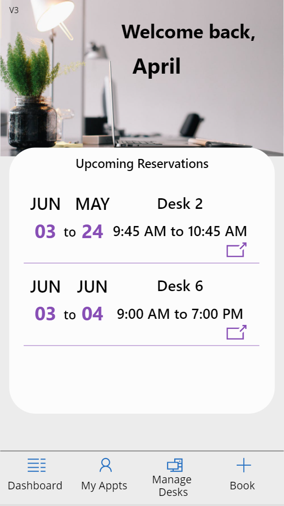
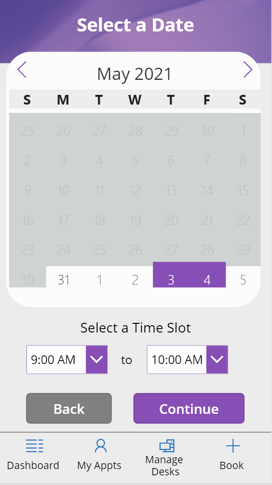
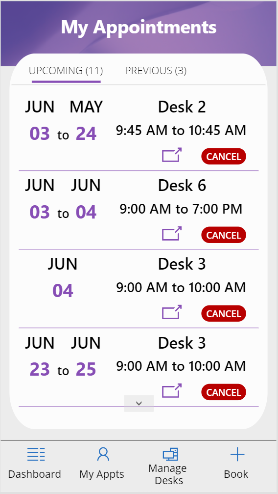
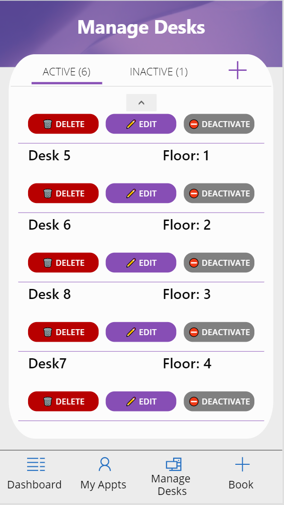

# Desk Reservation App Template

This is a clone of April Dunnam's repo [Desk Reservation](https://github.com/aprildunnam/PowerApps/tree/master/DeskReservation).

This repo includes a PnP list template to apply to the SharePoint site and a version of the app that consumes these lists.

Apply the template using the PnP PowerShell module:

```PowerShell
$siteUrl = 'https://yourtenant.sharepoint.com/sites/deskreservation'
Connect-PnpOnline -Url $SiteUrl
Invoke-PnpSiteTemplate -Path DeskReservation.xml -Handlers Lists
```

Other minor changes included:
* The calendar starts on Monday.
* Changed CheckOutFromNumber and CheckOutToNumber formats to yyyymmddhhmm in the SharePoint list.

Original Readme below.

## Summary

This is a fully functional phone-based Canvas Power App template which provides functionality to manage and book desk reservations.  This template can be customzied to meet a variety of booking needs from parking spaces to desks and meeting rooms and more.

You can see an overview of the new features added to this template in this video: [Desk Reservation Template V3](https://youtu.be/JgvQjQsJa80)






## Applies to

* [Microsoft Power Apps](https://docs.microsoft.com/powerapps/)

[](https://www.buymeacoffee.com/aprildunnam)


## Compatibility


## Authors

Solution|Author(s)
--------|---------
Desk Reservation | [April Dunnam](LinkToYourGitHubProfile) ([@aprildunnam](https://twitter.com/aprildunnam)), Microsoft

## Version history

Version|Date|Comments
-------|----|--------
1.0|May 31, 2021|Initial release

## Features

This sample illustrates the following concepts:

* Design patterns, including using the HTML control for additional styling capability
* Utilizing components (calendar, tabs, preloader)
* Multi-screen form process

## Prerequisites

None

## Data Sources

This template uses SharePoint as it's main data source and consists of two different lists.

### Desks List

This SharePoint list contains the information about the desks that people can book.  Set the list up as follows:

|Type|Internal Name|Required|
|---|---|:---:|
|Single line of text|Title|Yes|
|Multiple lines of text|Description|No|
|Image|Map|No|
|Number|Active|No|
|Single line of text|Floor|No|

### Desks Reservations List

This SharePoint list contains the reservation information.  Set the list up as follows:

|Type|Internal Name|Required|
|---|---|:---:|
|Single line of text|Title|Yes|
|Single line of text|DeskText|Yes|
|Person or Group|ReservedBy|Yes|
|Date and Time|CheckOutFrom|No|
|Date and Time|CheckOutTo|No|
|Single line of text|CheckOutFromText|No|
|Single line of text|CheckOutToText|No|
|Number|CheckOutFromNumber|No|
|Number|CheckOutToNumber|No|
|Choice["Booked","Checked In"]|Status|Default: Booked|

### DeskAdmins List

This SharePoint list contains the email addresses of people who should have admin access in the app (to manage desks).  Set the list up as follows:

|Type|Internal Name|Required|
|---|---|:---:|
|Single line of text|Title|Yes|


## Minimal Path to Awesome

* [Download](https://github.com/aprildunnam/PowerApps/blob/master/DeskReservation/solution/DeskBooking2023.zip) the `.msapp` from the `solution` folder
* Within **Power Apps Studio**, use the `.msapp` file using **File** > **Open** > **Browse** and select the `.msapp` file you just downloaded.
* Select the **Data** tab
* Click the "..." next to the Desk Reservations and Desks data connections and select "remove"
* Select "Add Data" and search for SharePoint
* Navigate to the site url that you created the SharePoint lists in an add back in the Desks and Desks Reservations lists

## Using the Source Code

  You can also use the [Power Apps Source Code tool](https://github.com/microsoft/PowerApps-Language-Tooling) to the code using these steps:

* Clone the repository to a local drive
* Pack the source files back into `.msapp` file:
  * [Power Apps Tooling Usage](https://github.com/microsoft/PowerApps-Language-Tooling)
* Within **Power Apps Studio**, use the `.msapp` file using **File** > **Open** > **Browse** and select the `.msapp` file you just packed.

## Disclaimer

**THIS CODE IS PROVIDED *AS IS* WITHOUT WARRANTY OF ANY KIND, EITHER EXPRESS OR IMPLIED, INCLUDING ANY IMPLIED WARRANTIES OF FITNESS FOR A PARTICULAR PURPOSE, MERCHANTABILITY, OR NON-INFRINGEMENT.**

## Support

While I don't support samples, if you encounter any issues while using this sample, you can [create a new issue](https://github.com/aprildunnam/powerapps/issues/new?)

## For more information

- [Overview of creating apps in Power Apps](https://docs.microsoft.com/powerapps/maker/)
- [Power Apps canvas apps documentation](https://docs.microsoft.com/en-us/powerapps/maker/canvas-apps/)


